# Money Tracker Backend


[How to Run Application?](#run-application-with-docker)

[How to Run Application Locally?](#run-backend-locally)

[How to Connect API?](#step-by-step-to-use-api)

[How to Use API?](#example-of-api-endpoints)


## How to Use Generated API
### Connect to API
1. To generate the API of the application, you first need to log in or register for an account. endpoints:
 - login: **/api/login**
 - register: **/api/register**

2. Once you're logged in, you will receive an access token that looks like this:
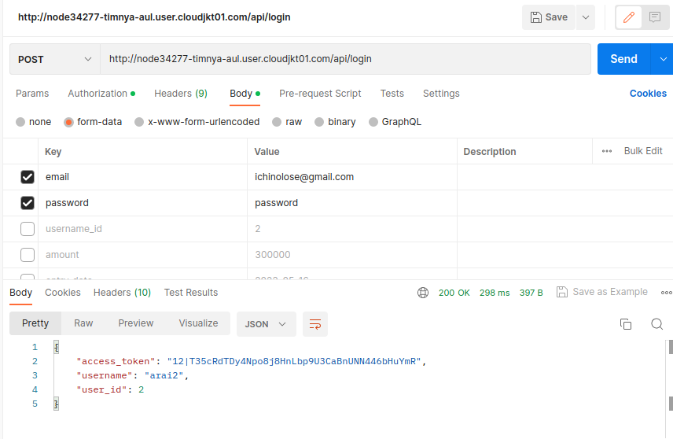

3. When making a request, add your token to the authorization header. If you're using Postman, you can do it like this:
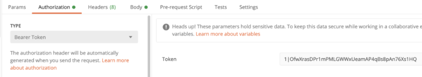

4. Now, you can make any API requests that exist in the application. Checkout: [API endpoints](#example-of-api-endpoints)
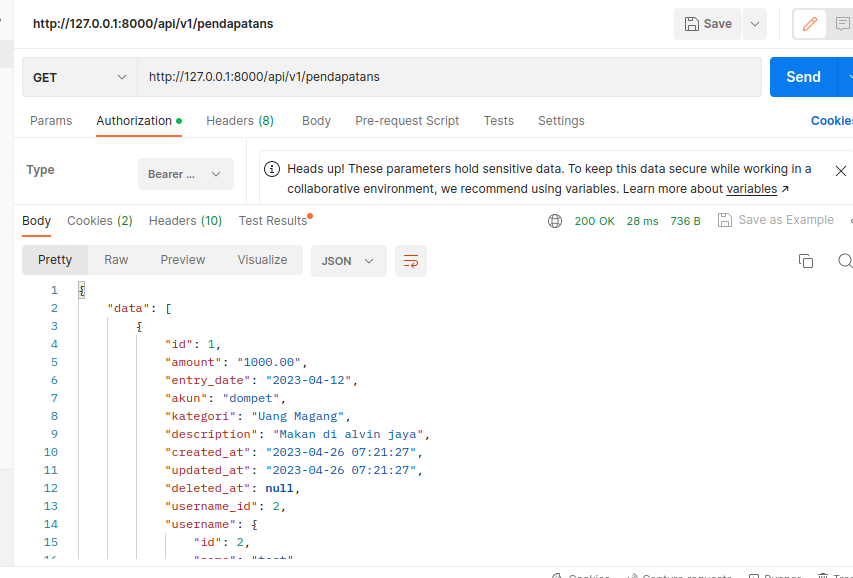

5. For more information on generating a token, you can refer to:
[Generate token for Laravel sanctum](https://blog.quickadminpanel.com/quickadminpanel-api-generator-with-laravel-sanctum/)

### Example of API endpoints
> Refference Usage:

* Endpoints for login /api/login


* Endpoint for register /api/register

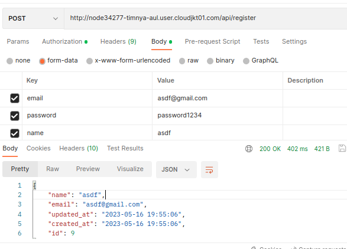


> Default URL endpoints for all CRUDs are /api/v1/[crud_name].

**Cruds: pendapatans**
* GET /api/v1/pendapatans - get the list of pendapatans

* POST /api/v1/pendapatans - create new pendapatans
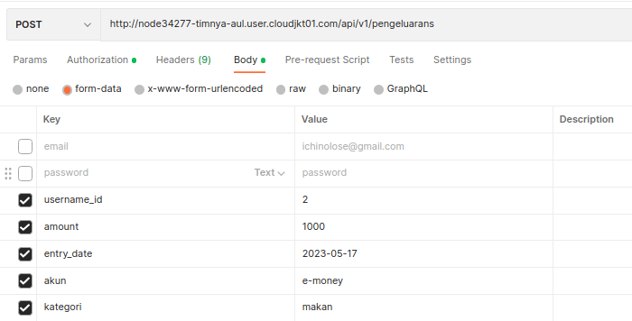
* GET /api/v1/pendapatans/1 - get the pendapatans base on username_id = 1
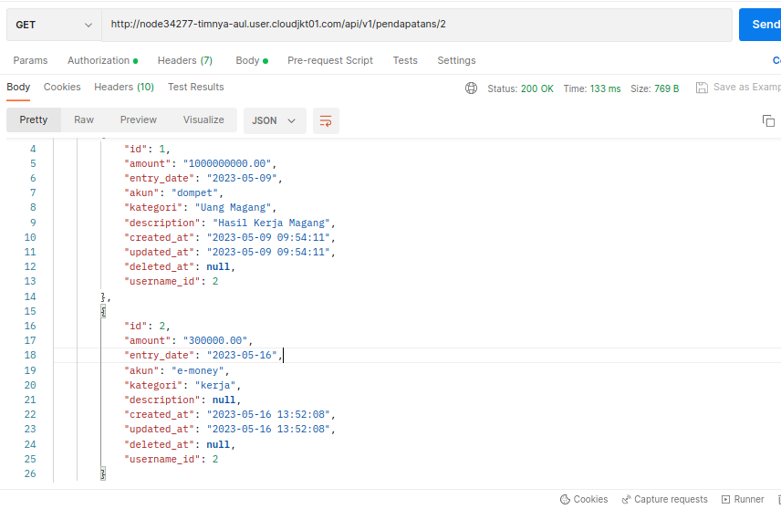
* PUT /api/v1/pendapatans/1 - update pendapatans for pendapatans.id = 1
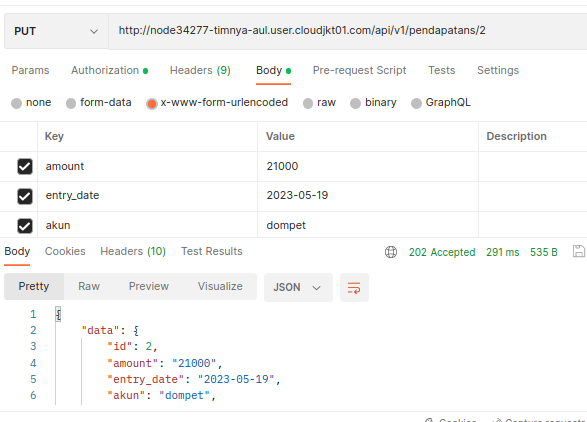
* DELETE /api/v1/pendapatans/1 - delete pendapatan with pendapatan.id = 1
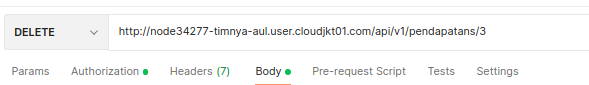

same implementation but different cruds

**Cruds: pengeluarans**
* GET /api/v1/pengeluarans - get the list of pengeluarans
* POST /api/v1/pengeluarans - create new pengeluarans
* GET /api/v1/pengeluarans/1 - get the pengeluarans base on username_id = 1
* PUT /api/v1/pengeluarans/1 - update pengeluarans for pengeluarans.id = 1
* DELETE /api/v1/pengeluarans/1 - delete pendapatan with pengeluarans.id = 1

**Cruds: tambah-tagihans**
* GET /api/v1/tambah-tagihans - get the list of tambah-tagihans
* POST /api/v1/tambah-tagihans - create new tambah-tagihans
* GET /api/v1/tambah-tagihans/1 - get the tambah-tagihans base on username_id = 1
* PUT /api/v1/tambah-tagihans/1 - update tambah-tagihans for tambah-tagihans.id = 1
* DELETE /api/v1/tambah-tagihans/1 - delete pendapatan with tambah-tagihans.id = 1

> Additional

**total uang**
For total of username_id
* GET /api/total-uang/{username_id}
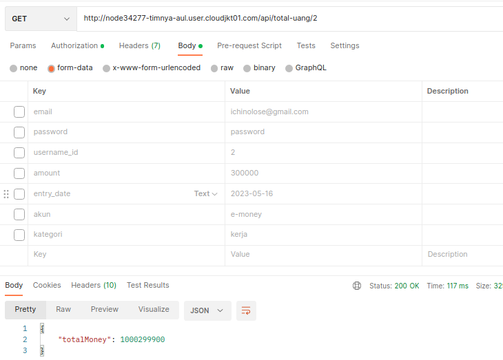

For specific account 
* GET /api/total-uang/{akun}/{username_id}
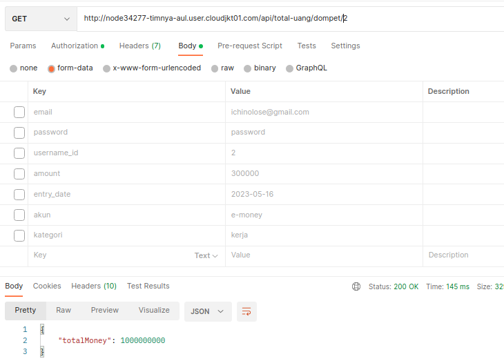
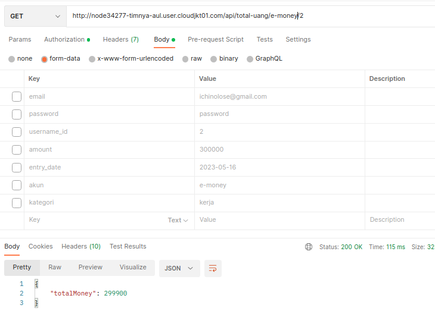


### API-related code/script
The API related file that maybe you need to know are located in:

API route handler: [./routes/api.php](./routes/api.php)

API controllers: 
- each cruds: [./app/Http/Controllers/Api/V1/Admin](./app/Http/Controllers/Api/V1/Admin)
- auth controller (login and register): [./app/Http/Controllers/Api/AuthController.php](./app/Http/Controllers/Api/AuthController.php)

API requests for some methods: [./app/Http/Requests/](./app/Http/Requests/)

API resources: [./app/Http/Resources/Admin/](./app/Http/Resources/Admin/)

For more information, please refer to this refference: [API generator](https://helpdocs.quickadminpanel.com/create-panel/api-generator)


## Run Application with Docker
Make sure you already install docker in your service or device. To start simply run:

```sh
docker-compose up -d --build
```
To stop, run:

```sh
docker-compose down
```


## Run Backend Locally

Clone the repo locally:

```sh
git clone https://github.com/faizbyp/moneytracker-ads.git money_tracker
cd money_tracker/backend
```

Install PHP dependencies:

```sh
composer install
```
Alternative ways use (in case errors exist)
```sh
composer install --ignore-platform-reqs
```
or
```sh
composer update --ignore-platform-reqs
```

Setup configuration:

```sh
cp .env.example .env
```

Edit .env and set your database connection details. 

```sh
DB_CONNECTION=mysql
DB_HOST=127.0.0.1
DB_PORT=3306
DB_DATABASE=ads 
DB_USERNAME=root
DB_PASSWORD=
```
<i><b>Note: Dont forget to start your mysql DBMS</b></i>

Run database migrations:
- sometimes when migrate, the db isnt automatically created  so you need to create db manually

```sh
php artisan migrate --seed
```
Generate application key:

```sh
php artisan key:generate
```

Run storage link app:

```sh
php artisan storage:link
```

Run the dev server (the output will give the address):

```sh
php artisan serve
```
And now the setup is complete!

## Admin Dashboard 

* Visit the url addr in your browser, and login with or register:

**Roles: Admin**
- **Username:** admin@gmail.com
- **Password:** password

**Roles: User**
- **Username:** test@gmail.com
- **Password:** password
<br>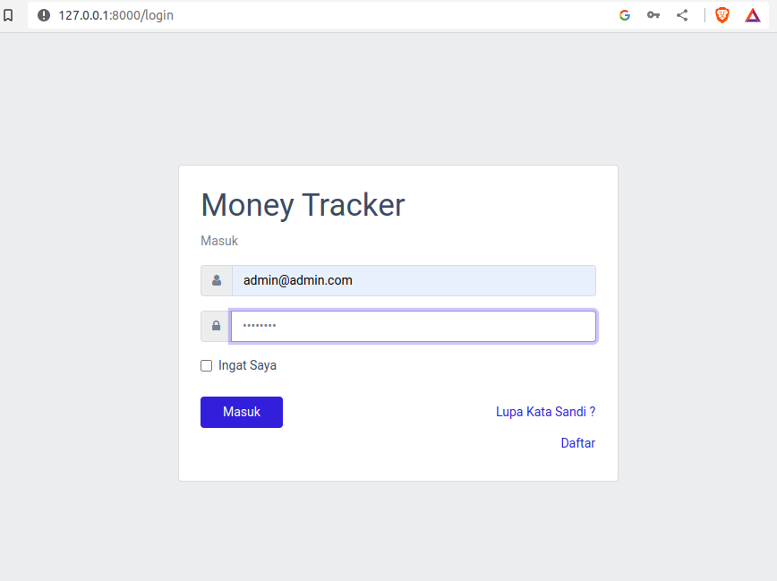

* Admin dashboard preview:
<br>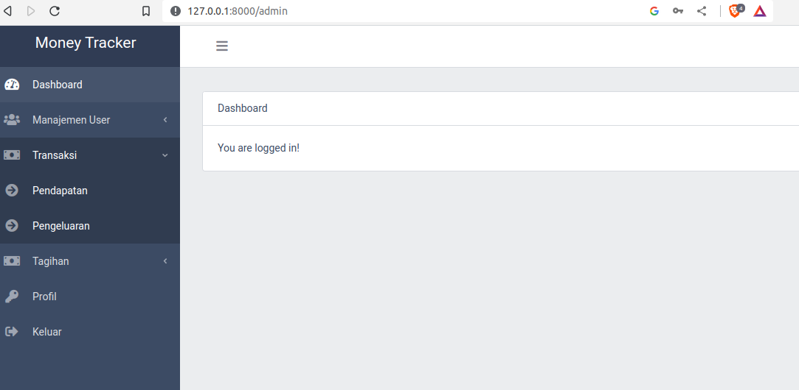